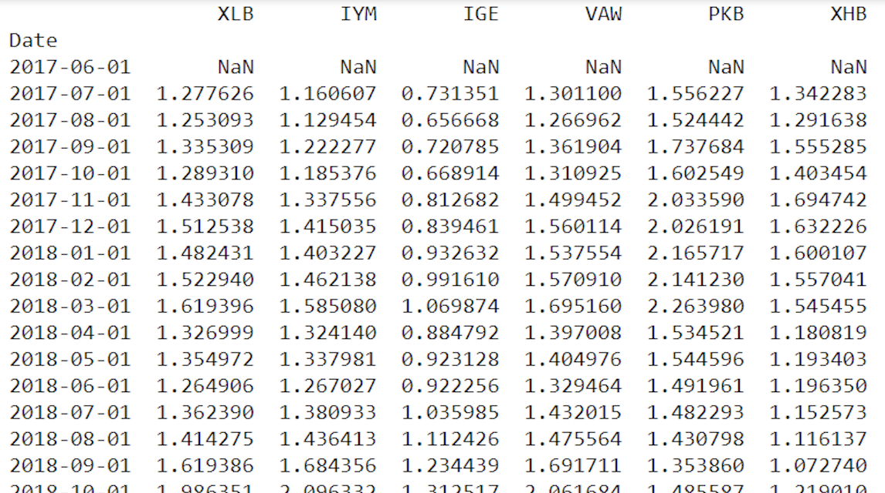
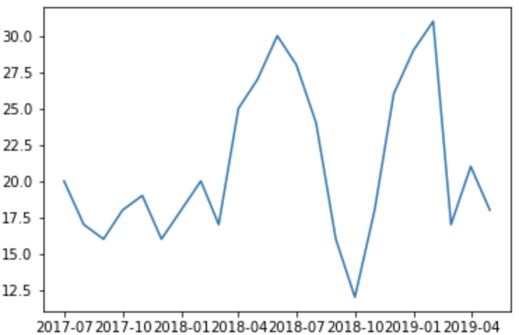
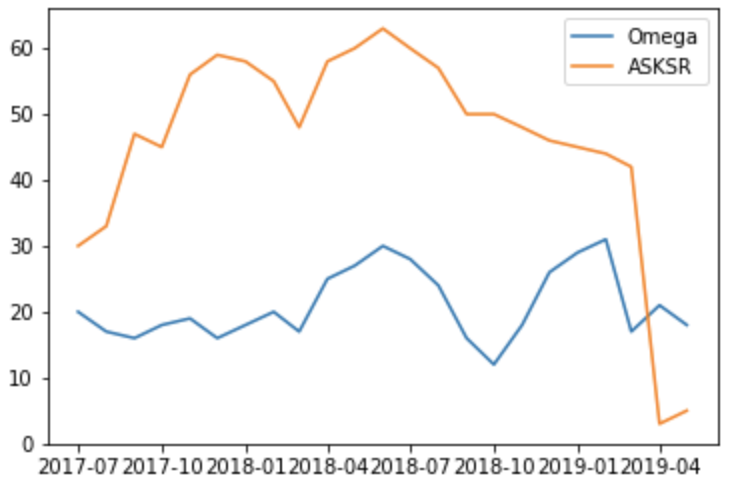
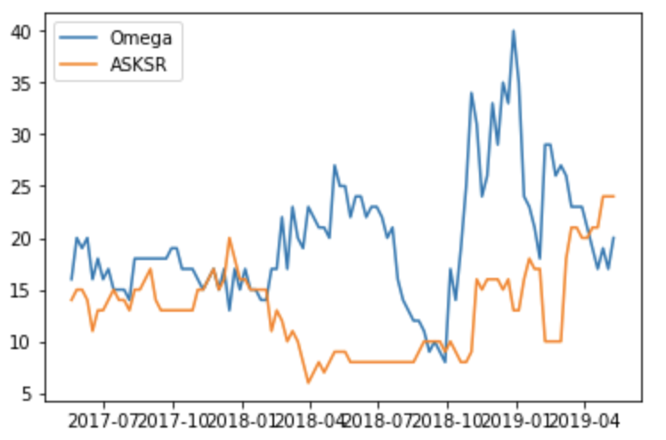
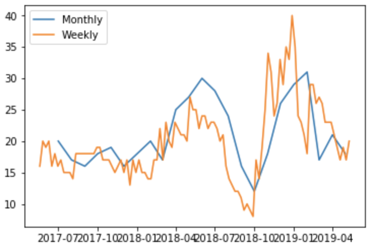
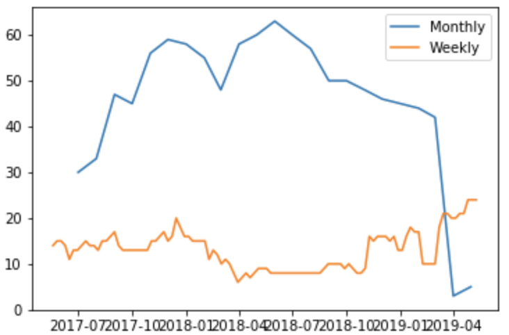

# HW4 - ETF measurements comparison

## 小組成員
第12組
- R07723032 黃郁珺
- B06902033 黃奕鈞
- B06902106 宋岩叡

## ETF
共66檔ETF
XLB, IYM, IGE, VAW, PKB, XHB, ITB, GDX, XME, MXI, PYZ, SLX, RTM, UYM, SMN, FXZ, MOO, CUT, WOOD, HAP, PSAU, PAGG, FLM, GRES, GDXJ, CHIM, FTRI, FTAG, SBM, PSCM, SIL, COPX, LIT, GNR, REMX, GOEX, URA, NUGT, DUST, CROP, SOIL, GUNR, PICK, RING, SLVP, VEGI, SILJ, JNUG, JDST, FMAT, SGDM, GDXX, GDXS, HOML, SGDJ, NAIL, NANR, VOX, ERUS, IYZ, FCOM, IXP, XTL, WBIF, FONE, LTL

## Source
Yahoo finance

## 指標類型
* Sharpe ratio
* Omega
* Riskiness

計算方式： 下載ETF的5年歷史資料，利用rolling window的方式，以3年時間計算以上三指標（156 w or 36 m）

## 績效評比
以Omega月資料為範例

績效資料:

### 不同指標結果 (以XLB為例) 

* Omega月資料排名

以XLB此檔ETF作為範例畫出Omega月資料排名狀況

Omega值與ASKSR值的排名狀況，可發現以兩者比率進行報酬排名的差異性大

週排名狀況

可看出投資標的依據不同績效評比指標的排名變動幅度大

### 週資料 vs. 月資料

若進一步確認週資料與月資料的績效排名狀況，同樣以XLB此檔ETF為範例

以Omega值做績效評比

週資料與月資料走勢相一致，排名狀況相似

但若以ASKSR值做績效評比

發現週資料與月資料排名狀況差異甚大

若要選擇評比指標，應以Omega值作為參考依據，具有較高穩定性

## 投資策略
使用Omega值作為績效評比依據，
* 可藉由前一期的績效評比決定本期投資標的，如以績效最好的前10檔基金組成投組進行投資。但須每期調整，月資料較為合適
* 視長期表現最佳的ETF決定投資標的，也可以最好的幾檔基金作為投組。

而投資策略的共同問題皆為前一期報酬最高不一定代表本期報酬好，須特別留意